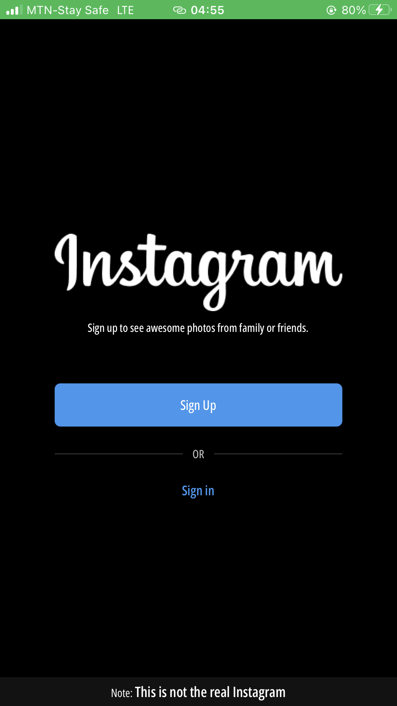
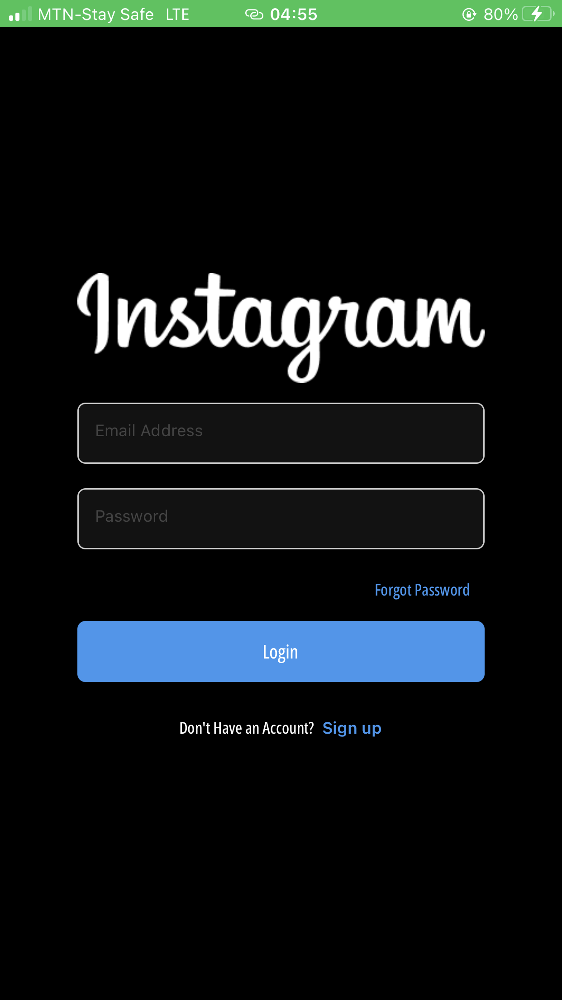
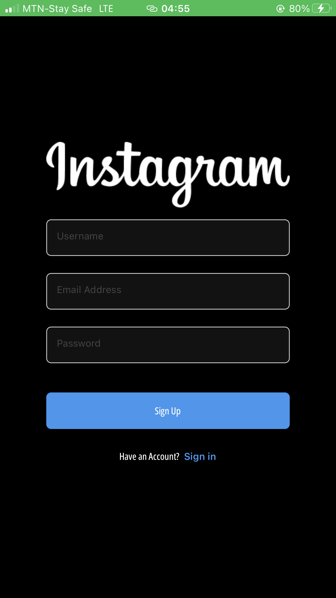
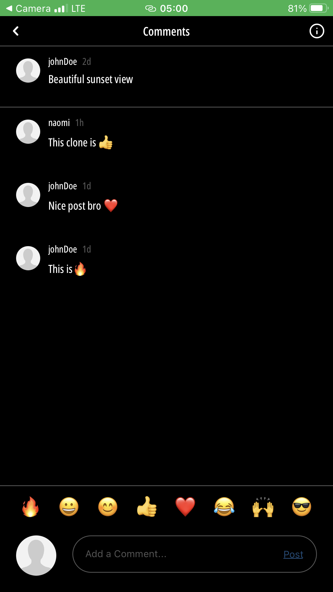
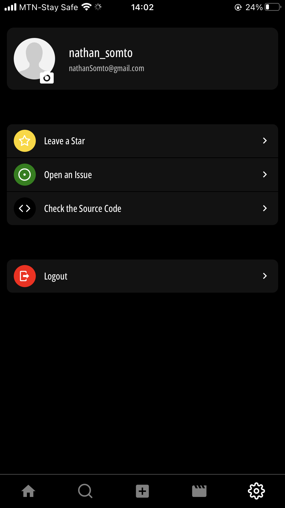

<div align="center">

  
  
  # Instagram React Native  Clone!

<h4>
    <a href="">View Demo</a>
  <span> · </span>
    <a href="https://github.com/blob/master/Nathan-Somto/Instagram-rn-clone/README.md">Documentation</a>
  <span> · </span>
    <a href="https://github.com/Nathan-Somto/Instagram-rn-clone/issues">Report Bug</a>
  <span> · </span>
    <a href="https://github.com/Nathan-Somto/Instagram-rn-clone/issues">Request Feature</a>
  </h4>
</div>


<!-- #### 🔴 Open the camera app on your device and scan the code below (live demo) -->

## :construction: Status
Finished Developing
Yet to Publish :cry:
## :star2: About the Project

### :camera: Screenshots

#### Welcome Screen
<div align="center">
   
</div>

#### Sign in Screen
   <div align="center">
   
</div>

#### Sign up Screen

   <div align="center">
   
</div>

#### Home Screen
 <div align="center">
   
   
</div>

#### Comments Screen
  <div align="center">
   
</div>

#### New Post Screen

<div align="center">
   
</div>

#### Search Screen
 <div align="center">
   
</div>

#### Reels Screen
 <div align="center">
   
</div>

#### Settings Screen
 <div align="center">
   
</div>


## :books: Tech
<details>
  <summary>Front End</summary>
  <ul>
  
    <li><a href="https://docs.expo.dev/workflow/expo-cli">Expo</a></li>
    <li><a href="https://reactnative.dev">React Native</a></li>
    <li><a href="https://reactnavigation.org/docs/">React Navigation</a></li>
  </ul>
</details>


<details>
  <summary>Back End</summary>
  <ul>
    <li><a href="https://www.firebase.com/">Firebase</a></li>
  </ul>
</details>

## :car: Getting Started

### :gear: Installation

1. Clone my Repo
```bash
  git clone https://github.com/BernaDeryaDen/InstagramCloneApp.git

```
2. Install Expo globally

```bash
npm install --global expo
```

3. Enter into the Project

```bash
   cd Instagram-bdd-clone-main
```

4. Install all dependencies

```bash
   npx expo install
```

5. Start the server

```bash
   expo start
```

# Expo Publish
exp://exp.host/@brndryden/instagram-bdd-clone?release-channel=default
https://expo.dev/accounts/brndryden/projects/instagram-bdd-clone
